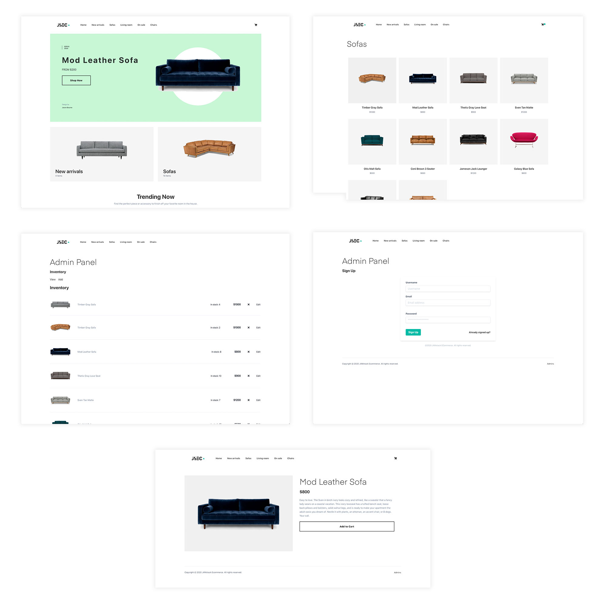

## Single Table Design with JAMstack ECommerce Professional (Beta)

JAMstack ECommerce Professional provides a way to quickly get up and running with a fully configurable JAMstack E Commerce site.

Out of the box, the site uses completely static data coming from a provider at `providers/inventoryProvider.js`. You can update this provider to fetch data from any real API by changing the call in the `getInventory` function.



> This project is based off @sw-yx and @dabit3's Jamstack repo. The purpose is to highlight Single Table Design with Amplify and AppSync

### Getting started

1. Clone the project

```sh
$ git clone https://github.com/jamstack-cms/jamstack-ecommerce.git
```

2. Install the dependencies:

```sh
$ yarn

# or

$ npm install
```

3. Initialize Amplify

```sh
$ amplify init

$ amplify init
Note: It is recommended to run this command from the root of your app directory
? Enter a name for the environment master
? Do you want to use an AWS profile? Yes
? Please choose the profile you want to use default

⠋ Initializing project in the cloud...

✔ Successfully created initial AWS cloud resources for deployments.
✔ Initialized provider successfully.
? Do you want to configure Lambda Triggers for Cognito? No
? Enter the name of the group to which users will be added.
Initialized your environment successfully.
```

4. Deploy the project to the cloud

```sh
$ amplify push
```

6. Go to S3 bucket named product images. Change the bucket permissions bucket policy to have the follow:

```json
{
  "Version": "2012-10-17",
  "Statement": [
    {
      "Effect": "Allow",
      "Principal": "*",
      "Action": "s3:GetObject",
      "Resource": "arn:aws:s3:::<INSERT NAME OF YOUR BUKET>/public/*"
    }
  ]
}
```

7. Run the project

```sh
$ gatsby develop

# or to build

$ gatsby build
```

## About the project

## DynamoDB Design

| Entity            | PK                      | SK                                                                                      |
| ----------------- | ----------------------- | --------------------------------------------------------------------------------------- |
| Products          | VENDOR\# <VendorID>     | PRODUCT\# <ProductID>                                                                   |
| ProductCategories | CATEGORY\# <CategoryId> | <CreatedAt\-YYYY\-MM\-DD> \#PRICE\#<Price> \#VENDOR\# <VendorID>\#PRODUCT\# <ProductID> |
| Categories        | CATEGORY                | CATEGORY\# <CategoryName>                                                               |
| Vendors           | VENDOR\# <VendorID>     | VENDOR\# <VendorID>                                                                     |

| Entity            | GSI1PK                  | GSI2PK                                                                     |
| ----------------- | ----------------------- | -------------------------------------------------------------------------- |
| Products          |                         |                                                                            |
| ProductCategories | CATEGORY\# <CategoryId> | PRICE\#<Price\(includes all zeros to 10 mil including cents\)\#<CreatedAt> |
| Categories        | CATEGORY                | CATEGORY\# <CategoryName>                                                  |
|                   |                         |                                                                            |

| Access Patterns                            |                                                                                       | Source Notes              |
| ------------------------------------------ | ------------------------------------------------------------------------------------- | ------------------------- |
| Get Products By Category By Date           | PK = CATEGORY\# <CategoryId></CategoryId>, SK = between\(YYYY\-MM\-DD, YYYY\-MM\-DD\) | ProductTable \- MainIndex |  |
| Get ProductsByVendor                       | PK = VENDOR\# <VendorID>                                                              | ProductTable \- MainIndex |  |
| Get Categories                             | PK = CATEGORY                                                                         | ProductTable \- MainIndex |  |
| Get Vendor                                 | PK = VENDOR\# <VendorID>, SK = VENDOR\# <VendorID>                                    | ProductTable \- MainIndex |  |
| Get Product By Category By Price           |                                                                                       | ProductTable \- GSI1      | When creating the GSI1SK on ProductCategories |
|                                            |                                                                                       |                           | , the length of numbers for price will always be the same |
| Add Category                               | PK = "CATEGORY", SK = CATEGORY\# <CategoryId>                                         |                           |  |
| Add Product to Category \| CategoryProduct |                                                                                       |                           | SK Date is comprised of Products original CreatedAt\. |
|                                            |                                                                                       |                           | Will also need TransactWriteItems to update original Product Record after creating CategoryProduct |
|                                            |                                                                                       |                           |  |

## Amplify/AppSync/Lambda resources that were modified to accomodate single table design

amplify/backend/api/singletable/stacks
amplify/backend/api/resolvers/Query.listCategorys.req.vtl
amplify/backend/api/resolvers/Query.listProducts.req.vtl
amplify/backend/api/resolvers/Category.products.req.vtl
amplify/function/directLambdaResolver/src/index
amplify/function/directLambdaResolver/src/resolvers

### Tailwind

This project is styled using Tailwind. To learn more how this works, check out the Tailwind documentation [here](https://tailwindcss.com/docs).

### Components

The main files, components, and images you may want to change / modify are:

**Logo** - src/images/logo.png  
**Buttons, Nav, Header** - src/components  
**Form components** - src/components/formComponents  
**Context (state)** - src/context/mainContext.js  
**Pages (admin, cart, checkout, index)** - src/pages  
**Templates (category view, single item view, inventory views)** - src/templates

### How it works

As it is set up, inventory is fetched from a local hard coded array of inventory items. This can easily be configured to instead be fetched from a remote source like Shopify or another CMS or data source by changing the inventory provider.

#### Configuring inventory provider

Update **providers/inventoryProvider.js** with your own inventory provider.

### Updating with Auth / Admin panel

1. Update **src/pages/vendor.js** with sign up, sign, in, sign out, and confirm sign in methods.

1. Update **src/pages/invenotry.js** Admin Container Page for Inventoy and Categories .

1. Update **src/templates/ViewInventory.js** with methods to interact with the actual inventory API.

1. Update **src/components/formComponents/AddInventory.js** with methods to add item to actual inventory API.

### Other considerations

#### Server-side processing of payments

To see an example of how to process payments server-side with stripe, check out the [Lambda function in the snippets folder](https://github.com/jamstack-cms/jamstack-ecommerce/blob/master/snippets/lambda.js).

Also, consider verifying totals by passing in an array of IDs into the function, calculating the total on the server, then comparing the totals to check and make sure they match.
